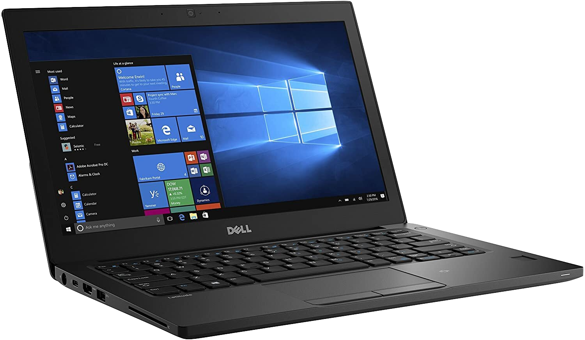

# EFI for Dell Latitude 7280 - Opencore
## Opencore 1.0.5 [DEV]
## macOs Ventura 13.7.4 (c)

## Specs:

  - **CPU:** Intel® Core™ i5-7300U Processor
  - **GPU:** Intel HD Graphics 620 @ 2048 MB
  - **Memory:** 16 GB RAM 2133 MHz
  - **Disk:** SK Hynix SC308 256 GB NVME SSD
  - **Screen Resolution:** 1366 x 768
  - **BIOS:** 1.40
  - **WiFi:** Intel® Wireless-AC 9260
  - **Audio:** Realtek ALC256(ALC3246)
  - **SMBIOS:** MacbookPro14,1

## Works:
  * Battery
  * HDMI output up to 2 screens
  * Audio
  * FN Sound/Brightness shortcuts
  * WiFi & Bluetooth - Intel
  * Trackpad
  * SD Card Reader - Realtek

## Doesn't Work:
  * AirDrop - Intel WiFi

### Notes:
* [GeekBench 6 Score](https://browser.geekbench.com/v6/cpu/1559376)
